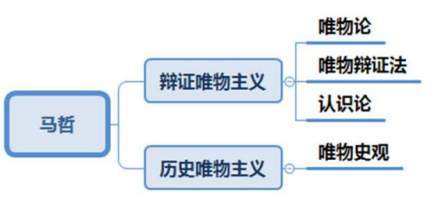
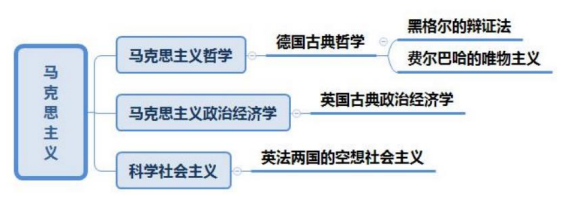

# 目录<!-- omit from toc -->
- [一、哲学](#一哲学)
  - [1.1 哲学的基本问题](#11-哲学的基本问题)
  - [1.2 哲学的基本派系](#12-哲学的基本派系)
- [二、唯物主义](#二唯物主义)
  - [2.1 古代朴素唯物主义](#21-古代朴素唯物主义)
  - [2.2 近代形而上学唯物主义](#22-近代形而上学唯物主义)
  - [2.3 马克思主义哲学](#23-马克思主义哲学)
- [三、唯心主义](#三唯心主义)
- [四、马克思主义](#四马克思主义)

# 一、哲学
哲学是理论化、系统化的世界观，是世界观和方法论的统一

**世界观**：人们对世界的观点、观念、看法

+ 不是所有的世界观都可以等同于哲学，哲学是理论化、系统化的世界观
+ 哲学不是都是科学的

## 1.1 哲学的基本问题
思维与存在的关系问题、意识与物质的关系问题

哲学基本问题的提出者是`恩格斯`
> 1. 思维和存在、意识和物质何者是`本原`，即何者是`第一性`的问题
> 
>       对这方面问题的不同回答，是划分`唯物主义`和`唯心主义`两大派别的根本标准
> 2. 思维和存在有无`同一性`的问题，即人的思维能否正确认识存在以
及如何认识现实世界的问题
>
>       根据对这个问题的不同回答，可以将哲学划分为`可知论`和`不可知论`
## 1.2 哲学的基本派系
+ 唯物主义
+ 唯心主义
# 二、唯物主义
唯物主义认为世界的本原是物质，但对物质的认识不是一步到位的，经历了由浅到深的过程，划分为三种历史形态：
1. 古代朴素唯物主义
2. 近代形而上学唯物主义
3. 辩证唯物主义和历史唯物主义，即马克思主义哲学
## 2.1 古代朴素唯物主义
把世界的本原归结为一种或几种实物，例如`五行`、`形`、`气`、`阴阳`
> 水是万物的始基
> 
> 形存则神存，形谢则神灭 —范缜
>
> 气者，理之依也
>
> 天地合而万物生，阴阳接而变化起 ——荀子
## 2.2 近代形而上学唯物主义
随着社会生产力的发展，对物质的认识进一步推进，将世界的本原归为原子

近代形而上学唯物主义唯物只唯了一半，因此又称`半截子唯物主义`
+ 缺陷
    - 机械性：近代形而上学唯物主义承认事物是运动的，但认为事物只做机械运动，即简单的空间位移，因此近代形而上学唯物主义又称`机械唯物主义`
    - 形而上学性：和辩证法相对立的概念，即用孤立、静止、片面的观
点看问题，满足其中一个就是形而上学性
    - 不彻底性：自然观是唯物的，坚持物质是世界的本原、物质决定意识；历史观是唯心的（唯心史观）
## 2.3 马克思主义哲学
基于研究领域的不同，把马克思主义哲学分为辩证唯物主义和历史唯物主义
+ 辩证唯物主义：研究自然界和人类思维，包括唯物论、唯物辩证法、
认识论
+ 历史唯物主义：研究社会领域，马克思研究人类社会发展的历史，坚持历史观是唯物的

**理论意义**
1. 坚持了彻底的`唯物主义一元论`，同二元论、唯心主义一元论划清了界限

        “元”指世界的本原；
        一元论指世界的本原有一个，世界的本原要么是物质、要么是意识
        若认为世界的本原是物质，物质决定意识，是唯物主义一元论
        若认为世界的本原是意识，是唯心主义一元论
        二元论认为世界的本原有两个，即物质和意识
2. 体现了唯物主义自然观和唯物主义历史观的统一，为彻底的唯物主义奠定了基础
3. 既坚持唯物主义，又坚持辩证法，实现了唯物主义与辩证法的内在统一
4. 马克思主义哲学实现了`实践`基础上的科学性和革命性的统一

        马克思主义哲学区别于其他哲学最主要、最显著的特征：实践性
# 三、唯心主义
根据世界的本源是谁的意识分为两种
+ `主观唯心主义`：人的感觉、精神决定一切，人的精神是世界的本原，如人、我、心
> 人是万物的尺度
>
> 我思故我在
>
> 吾心即宇宙
>
> 存在即被感知
+ `客观唯心主义`：独立于人之外的神秘客观精神决定一切。比如信上帝、神、如来佛祖、玉皇大帝等，强调人之外的精神决定一切，是客观唯心主义，如神、道、理、绝对精神/绝对观念、命
> 上帝、神、盘古、女娲
>
> 道生一，一生二，二生三，三生万物
>
> 存天理，灭人欲
>
> 生死有命，富贵在天
# 四、马克思主义
马克思主义是由`马克思`、`恩格斯`创立的，而由其后各个时代、各个民族的马克思主义者不断地丰富和发展的观点和学说的体系

`1848`年2月`《共产党宣言》`在`英国伦敦`的发表标志着马克思主义诞生

**特征**：科学性、革命性、`实践性`、`人民性`、`发展性`

**组成部分**：马克思主义哲学、马克思主义政治经济学和科学社会主义

**直接理论来源**：德国古典哲学、英国古典政治经济学、英法两国的空想社会主义

# 链接<!-- omit from toc -->
- [目录](./directory.md)
- 下一节：[马克思主义哲学](./01.2%20马克思主义哲学.md)