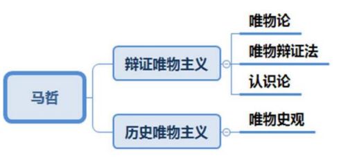

# 目录<!-- omit from toc -->
- [一、马克思主义哲学](#一马克思主义哲学)
- [二、唯物论](#二唯物论)
  - [2.1 物质](#21-物质)
    - [2.1.1 物质的存在方式和根本属性](#211-物质的存在方式和根本属性)
    - [2.1.2 物质和运动的关系](#212-物质和运动的关系)
    - [2.1.3 物质运动的基本形式](#213-物质运动的基本形式)
    - [2.1.4 运动与静止](#214-运动与静止)
  - [2.2 意识](#22-意识)
    - [2.2.1 意识的生理基础](#221-意识的生理基础)
    - [2.2.2 意识的本质](#222-意识的本质)
    - [2.2.3 意识的作用](#223-意识的作用)
  - [2.3 物质与意识的关系](#23-物质与意识的关系)
- [三、唯物辩证法](#三唯物辩证法)
  - [3.1 事物的普遍联系](#31-事物的普遍联系)
    - [3.1.1 联系的特征](#311-联系的特征)
    - [3.1.2 整体和部分的关系](#312-整体和部分的关系)
  - [3.2 事物的永恒发展](#32-事物的永恒发展)
  - [3.3 对立统一规律](#33-对立统一规律)
    - [3.3.1 矛盾的含义](#331-矛盾的含义)
    - [3.3.2 矛盾的基本属性](#332-矛盾的基本属性)
    - [3.3.3 矛盾的普遍性和特殊性](#333-矛盾的普遍性和特殊性)
    - [3.3.4 矛盾的不平衡性](#334-矛盾的不平衡性)
    - [3.3.5 事物发展的内因和外因](#335-事物发展的内因和外因)
  - [3.4 质量互变规律](#34-质量互变规律)
    - [3.4.1 量变与质变](#341-量变与质变)
    - [3.4.2 量变质变辩证关系](#342-量变质变辩证关系)
  - [3.5 否定之否定规律](#35-否定之否定规律)
    - [3.5.1 肯定和否定](#351-肯定和否定)
  - [3.6 内容和形式](#36-内容和形式)
  - [3.7 现象和本质](#37-现象和本质)
  - [3.8 原因和结果](#38-原因和结果)
  - [3.9 可能性和现实性](#39-可能性和现实性)
  - [3.10 偶然性和必然性](#310-偶然性和必然性)
- [四、认识论](#四认识论)
  - [4.1 实践](#41-实践)
  - [4.2 认识](#42-认识)
    - [4.2.1 感性认识](#421-感性认识)
    - [4.2.2 理性认识](#422-理性认识)
    - [4.2.3 感性认识和理性认识的辩证关系](#423-感性认识和理性认识的辩证关系)
    - [4.2.4 认识的过程](#424-认识的过程)
    - [4.2.5 认识运动](#425-认识运动)
    - [4.2.6 认识与实践](#426-认识与实践)
  - [4.3 真理](#43-真理)
- [五、历史唯物主义](#五历史唯物主义)

# 一、马克思主义哲学
关于自然、社会、思维等领域发展的一般规律，科学的世界观、方法论

马克思主义哲学是马克思主义的理论基础

马克思主义哲学来源于德国古典哲学
+ 黑格尔的辩证法
+ 费尔巴哈的唯物主义

# 二、唯物论
探究世界的本原（物质），马克思主义是是彻底的唯物主义，主张物质是世界的本原。包括物质、物质的存在方式和根本属性、意识、物质与意识的关系

## 2.1 物质
物质是标志客观实在的哲学范畴，这种客观实在是人通过感觉感知的，它不依赖于我们的感觉而存在，为我们的感觉所复写、摄影、反映。

物质的唯一特性：`客观实在性`

物质的定义的提出者是`列宁`
### 2.1.1 物质的存在方式和根本属性
`运动`是物质的存在方式和根本属性

运动是标志一切事物和现象的变化及其过程的哲学范畴

### 2.1.2 物质和运动的关系

1. 离开运动谈物质：承认世界是物质的，但认为所有的物质都不是动的

    是静止的观点看问题，导致形而上学的错误
2. 离开物质谈运动：承认世界是运动的，但不是物质在动，物质的对立面是精神、意识，强调意识在动

    犯了唯心主义的错误
### 2.1.3 物质运动的基本形式
机械运动、物理运动、化学运动、生物运动和`社会运动`

社会运动是最高级、最复杂的运动
### 2.1.4 运动与静止
静止是特殊的运动，是物质运动在一定条件下的稳定状态

相对静止有两种情形:
+ 相对于一定的参照物而言，是事物的空间位置相对不变
+ 事物的性质相对稳定，水加热会变成水蒸气，性质没有变化

运动与静止的关系：
+ 区别
    - 运动是绝对的、无条件的、永恒的。物质的根本属性是运动，故运动是绝对的，一直在动，没有任何附加条件
    - 静止是相对的、有条件的、暂时的。静止是相对于某个参照物而言的，故是相对的，而且要在一定条件下成立
+ 联系
    - 物质世界是绝对运动和相对静止的统一。万事万物既有绝对运动的一面，也有相对静止的一面
+ 割裂运动和静止的关系会导致两种错误的观点
    - 只承认相对静止而否认绝对运动会导致形而上学
    - 只承认绝对运动而否认相对静止则会导致相对主义诡辩论
## 2.2 意识
意识是自然界长期发展的产物，经由无机物的反应特征进化为低等生物的刺激感应性；低等生物的刺激感应性进化为高等动物的感觉和心理；动物心理进化为人的意识

意识也是社会的产物。`劳动`在意识产生的过程中起决定性作用
### 2.2.1 意识的生理基础
意识是人脑特有的机能，`人脑`是产生意识的物质器官
### 2.2.2 意识的本质
意识是对客观存在的主观反映
+ 客观存在：意识的根源来自客观存在，即意识的产生依赖于客观存在，没有客观存在就无法产生相应的意识
+ 主观反映：对同样的客观事物，不同的人有不同的反映
### 2.2.3 意识的作用
能动地认识世界，能动地改造世界

        能动：与“被动”相对应，指人积极主动、想方设法的做某些事情，即主观能动性

具体表现方面：
+ 意识具有目的性和计划性
  
  指人们反映客观世界时抱有一定的目的和动机，
实施行动前制定蓝图、目标，要有计划、有步骤的做事情
+ 意识具有自觉选择性和主动创造性
  
  并非客观世界有什么就反映什么，客观世界没有的，可以在思维世界中创造出来

## 2.3 物质与意识的关系
`物质决定意识`，意识反作用于物质

即正确的意识对客观事物的发展具有促进作用，错误的意识对事物的发展起阻碍作用

这就要求我们一切从实际出发，在遵循`客观规律`的基础上，充分发挥人的主观能动性

# 三、唯物辩证法
唯物辩证法的总特征：事物的普遍`联系`和事物的永恒`发展`
## 3.1 事物的普遍联系
联系是指事物内部诸要素之间以及事物之间的相互影响、相互作用和相互制约
### 3.1.1 联系的特征
联系具有`普遍性`、`客观性`、条件性、多样性
### 3.1.2 整体和部分的关系
1. 整体居于主导地位统率着部分
2. 关键部分对整体起决定作用
3. 整体是各个部分有机的结合，整体具有部分没有的新功能
> 当各个部分是以有序、合理的状态构成整体，则整体功能大于部分功能之和
>
> 若以无序、不合理的状态构成整体，则整体功能小于部分功能之和
## 3.2 事物的永恒发展
发展是具有前进性质的运动，是事物由低级向高级、由简单向复杂、由无序向有序的上升运动

发展的实质：`新事物的产生`和`旧事物的灭亡`

要用发展的眼光看问题

## 3.3 对立统一规律
揭示了事物发展的`源泉`和`动力`，即解释了事物为什么会向前发展

`对立统一规律`是唯物辩证法的`实质`和`核心`

### 3.3.1 矛盾的含义
矛盾是指事物内部或事物之间既对立又统一的关系
### 3.3.2 矛盾的基本属性
+ 斗争性：矛盾着的对立面之间相互排斥、相互分离的倾向和趋势
+ 同一性：指矛盾双方`相互依存`、`在一定条件下相互转化`的一种趋势和联系
### 3.3.3 矛盾的普遍性和特殊性
+ 普遍性
  + 矛盾存在于`一切事物`的发展过程中
  + 每一事物的发展过程中存在着自始至终的矛盾运动
+ 特殊性
  + 指具体事物所包含的矛盾以及每一矛盾的各个方面都有其特点

矛盾普遍性和特殊性的关系:
+ 区别：矛盾的`普遍性`是事物的`共性`；矛盾的`特殊性`是事物的`个性`
+ 联系：矛盾的普遍性寓于特殊性之中，并通过特殊性表现出来

矛盾的普遍性要求我们运用矛盾分析法分析一切事物；

矛盾的特殊性要求我们在分析事物时要做到具体问题具体分析。

### 3.3.4 矛盾的不平衡性
<table>
    <thead>
        <tr>
            <th>范围</th>
            <th>分类</th>
            <th>地位</th>
            <th>作用</th>
        </tr>
    </thead>
    <tbody>
        <tr>
            <td rowspan="2">存在多个矛盾</td>
            <td>主要矛盾</td>
            <td>支配地位</td>
            <td>起绝对性作用</td>
        </tr>
        <tr>
            <td>次要矛盾</td>
            <td>从属地位</td>
            <td>次要作用</td>
        </tr>
        <tr>
            <td rowspan="2">同一个矛盾</td>
            <td>矛盾的主要方面</td>
            <td>支配地位</td>
            <td>起主导作用</td>
        </tr>
           <tr>
            <td>矛盾的次要方面</td>
            <td>被支配地位</td>
            <td>次要作用</td>
        </tr>
    </tbody>
</table>

“重点、中心、关键、重中之重、首位” —抓主要矛盾

“主流、主体、性质、总的来说” —抓矛盾的主要方面

坚持两点论，反对一点论；坚持重点论，反对均衡论

    两点论：既要看到主要矛盾，也要看到次要矛盾
    一点论：只看主要矛盾，看不到次要矛盾
    重点论：突出重点，把握主要矛盾或矛盾的主要方面
    均衡论：与重点论相对，无论是主要的还是次要的，都一视同仁、付出一样的时间和精力
### 3.3.5 事物发展的内因和外因
内因是事物变化发展的根据和第一位原因，

外因是事物变化发展的条件，外因通过内因而起作用。

事物的发展是内外因共同作用的结果
## 3.4 质量互变规律
揭示了事物发展的形式和状态，事物在发展过程中呈现一种什么样的形式和状态，即质变和量变
### 3.4.1 量变与质变
+ 量变：事物数量的增减和组成要素排列次序的变动
+ 质变：事物根本性质的变化

量变和质变的区分标志：是否超出一定`度`

### 3.4.2 量变质变辩证关系
+ 量变是质变的必要准备
+ 质变是量变的必然结果
+ 量变和质变相互渗透，总的量变中有部分质变

坚持适度原则，重视量的积累。创造条件，促使事物向好的方向转化

## 3.5 否定之否定规律
揭示了事物发展的方向和道路，这一规律告诉大家事物是向哪里发展的、发展的过程和道路是怎样的

### 3.5.1 肯定和否定
+ 肯定是指事物保持自身存在的方面
+ 否定是指事物自身趋向灭亡、并转化为其他事物的趋势

辩证否定的实质是扬弃，即既克服又保留

任何事物的发展都要经历“肯定→否定→否定之否定”的过程，其中包括两
次否定三个阶段

事物的发展是前进性和曲折性的统一

## 3.6 内容和形式
+ 内容：事物内在的要素
+ 形式：事物外在的表现形式

内容决定形式，形式为内容服务，内容必须通过形式表现，形式对内容具有反作用，内容和形式存在于统一体中，不可分割

## 3.7 现象和本质
+ 现象: 是事物的外部联系和表面特征
  + 现象中有真象和假象。真象是从正面表现本质的现象，假象是从反面歪曲表现事物本质的现象。真象和假象都能够反映事物的本质
+ 本质：是事物的根本性质和事物基本要素的内在联系

透过现象看本质

## 3.8 原因和结果
+ 原因：引起某种现象的现象
+ 结果：被某种现象所引起的现象

原因和结果构成因果联系，因果关系具有时间顺序性，即原因在前，结果在后；原因和结果之间存在引起和被引起的关系

## 3.9 可能性和现实性
+ 可能性：潜在的、尚未实现的东西
+ 现实性：已经证实，肯定存在的东西

二者相互依存，相互关联，相互渗透，并在一定条件下相互转化

## 3.10 偶然性和必然性
+ 偶然性：事物发展过程中不一定发生，可能这样出现，也可能那样出现，是不确定的趋势
+ 必然性：事物发展过程中一定会发生、确定不移的趋势

对立性：二者产生的根据不同，在事物发展过程中所处的地位和作用不同

统一性：二者相互依存，相互渗透，在一定条件下可以相互转化，相互过渡

# 四、认识论
探究人的认识如何产生和发展

## 4.1 实践
实践是`人类`能动地改造世界的`客观物质活动`

实践活动的基本特点：客观物质性、自觉能动性、社会历史性

实践的基本形式：
+ 生产实践
  + 处理人和自然之间的关系，即人能够生存下来的实践活动
+ 社会实践
  + 处理人和人之间的关系
+ 科学实验
  + 科学家探索世界规律的实践活动

## 4.2 认识
### 4.2.1 感性认识
感性认识是认识的低级阶段，人们在实践过程中，通过自己的肉体感官直接接触客观外界，对各种事物的表面有了初步认识

感性认识包括相互联系、循序渐进的三种形式：
+ 感觉：对一个事物个别属性的认识
+ 知觉：在感觉的基础上对事物形成一种综合认识
+ 表象：对之前感觉、知觉的回忆和再现

### 4.2.2 理性认识
理性认识是认识过程的高级阶段，以事物的本质规律为认识对象，是对事物的内在联系的认识

理性认识的三种形式：
+ 概念：对事物本质属性的概括
+ 判断：在概念的基础上，对事物进行区分和识别
+ 推理：由已知推未知

### 4.2.3 感性认识和理性认识的辩证关系
+ 理性认识依赖于感性认识
+ 感性认识有待于发展为理性认识
+ 感性认识和理性认识相互渗透

### 4.2.4 认识的过程
在认识事物的过程中存在两次飞跃：
1. 感性认识到理性认识，从事物表面的认识上升到对事物内在本质的认识
2. 理性认识到实践，认识的最终目的是要应用到实践中，要回归到实践中加以检验

### 4.2.5 认识运动
认识运动具有反复性、无限性

认识运动是一个实践、认识、再实践的不断反复的过程。一个正确的认识，往往要经过多次反复，以达到预期的结果为标志，才算完成。

### 4.2.6 认识与实践
+ `实践决定认识`，实践是认识的唯一来源
+ 实践是认识发展的动力
+ 实践是认识的目的和归宿
+ 实践是检验认识正确与否的唯一标准
+ 认识对实践具有反作用，科学的认识对实践起促进作用，错误的认识对实践起阻碍作用

在实践中坚持和发展真理，认识世界和改造世界

## 4.3 真理
真理是人们对客观事物及其规律的正确反映

# 五、历史唯物主义

# 链接<!-- omit from toc -->
- [目录](./directory.md)
- 上一节：[哲学](./01.1%20哲学.md)
- 下一节：[马克思主义政治经济学](./01.3%20马克思主义政治经济学.md)